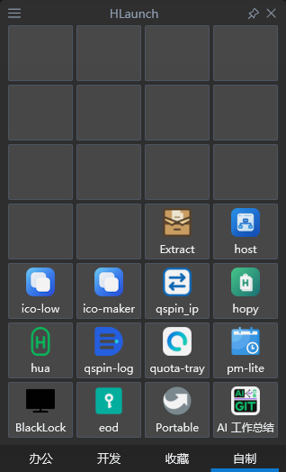
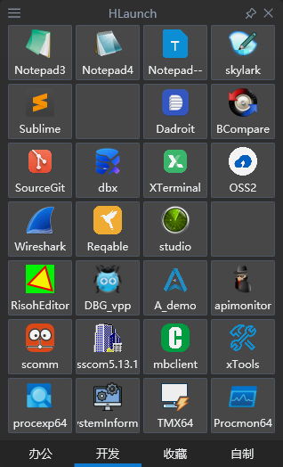

<p align="center">
  
</p>

<h1 align="center">HLaunch</h1>

<p align="center">把常用应用、文件和网址，放进一个随手可用的启动面板。</p>

<p align="center">
  
  
  
</p>

<p align="center"><strong>简体中文</strong> · <a href="README.en.md">English</a></p>

HLaunch 是一款 Windows 原生网格启动器。用图标和分类整理常用项目，按下快捷键即可唤出，输入名称就能搜索。单个 `HLaunch.exe` 即可运行，无需安装或额外运行库。

## 🖼️ 界面预览

<p align="center">
  
  
</p>

## ✨ 功能亮点

- **集中启动**：应用、文件、文件夹、快捷方式和网址，一个面板就够。
- **直观整理**：拖入即可添加；自由调整图标位置、跨分类移动和分类顺序，拖动窗口边缘增减网格行列。
- **随手唤起**：默认 `Alt+Space` 显示或收起面板，也可开启屏幕边缘、角落停留唤起。
- **快速查找**：直接输入名称，跨分类搜索；支持方向键选择和回车启动。
- **按需呈现**：内置深色界面，可调整背景效果与透明度，支持窗口置顶、多显示器和不同屏幕缩放。
- **本地便携**：配置保存在本机，无账号、无遥测；可通过托盘菜单开启开机自启。

## 🚀 快速上手

1. 将 `HLaunch.exe` 放到常用文件夹，双击运行。
2. 按 `Alt+Space` 唤出面板，把应用、文件或快捷方式拖进网格。
3. 单击图标启动项目；右键管理项目和分类。
4. 右键托盘图标打开“设置”，修改快捷键、开启边缘唤起或调整外观。

边缘唤起默认关闭，开启后默认避让全屏应用。点击面板关闭按钮只会收起窗口；退出程序请使用托盘菜单。

## ⌨️ 常用操作

除全局唤起快捷键外，以下操作均在面板内使用。

| 操作 | 快捷键 / 鼠标 |
| --- | --- |
| 显示 / 收起面板 | `Alt+Space`（可修改） |
| 搜索所有分类 | 直接输入，或 `Ctrl+F` |
| 选择 / 启动项目 | 方向键 / `Enter` |
| 切换分类 | 滚轮，或 `Tab` / `Shift+Tab` |
| 浏览上一页 / 下一页 | `PageUp` / `PageDown` |
| 添加 / 编辑选中项目 | `Insert` / `F2` |
| 切换窗口置顶 | `Ctrl+Space` |
| 收起面板 | `Esc`（搜索时先清空关键词） |

## 📁 数据与系统要求

配置和项目默认保存在程序旁的 `data` 文件夹；目录不可读写时，自动使用 `%LOCALAPPDATA%\HLaunch`。备份时复制实际使用的数据文件夹即可。便携目录内的应用支持相对路径，方便随文件夹一起迁移。

支持 **Windows 11 x64**；Windows 10 x64 仅尽力兼容。

<details>
<summary>🛠️ 从源码构建</summary>

准备支持 C++23 的 MSVC、Windows SDK、CMake 3.28+ 和 Ninja，在 MSVC x64 开发者终端运行：

```powershell
cmake --preset msvc-release
cmake --build --preset msvc-release
```

首次配置会联网获取构建依赖。生成文件：`out/build/msvc-release/src/HLaunch.exe`。

开发文档见 [docs/ai/README.md](docs/ai/README.md)。

</details>
